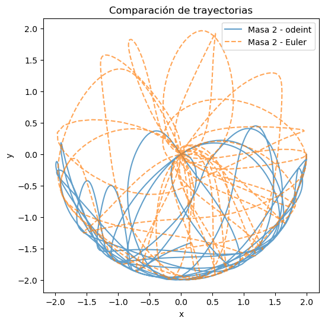
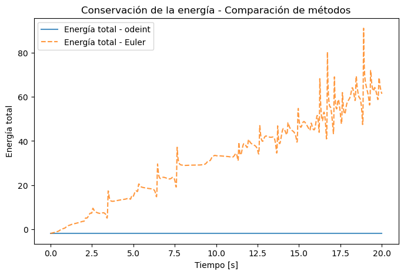
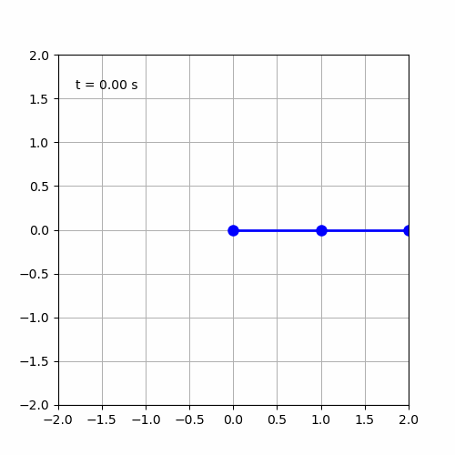
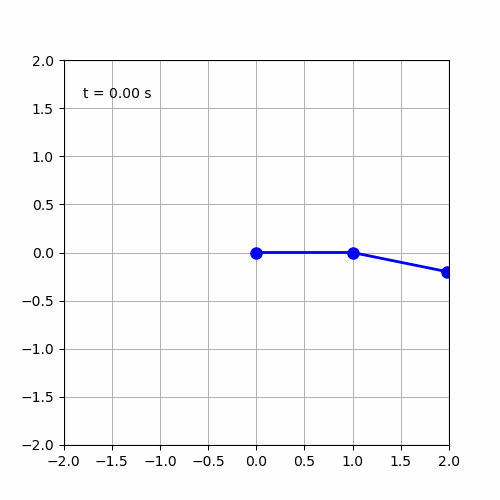

# Simulación del péndulo doble

Este proyecto simula el movimiento de un péndulo doble utilizando Python y resuelve sus ecuaciones de movimiento mediante `scipy.integrate.odeint` y mediante otro método mas sencillo llamado método de Euler. 

## Contenido
- Ecuaciones del péndulo doble
- Simulación numérica para distintas condiciones iniciales mediante los distintos métodos.
- Visualización de trayectorias y energías. Demostración de fortalezas y debilidades de cada método.
- Animación del movimiento y comparación. Demostración de la dinámica caótica.

## Tecnologías
- Python
- NumPy
- SciPy
- Matplotlib

## Ejemplo de resultados
- Trayectoria de las masas

  

Podemos observar como los dos métodos difieren en sus soluciones. Veamos en detalle qué ocurre con la energía en cada método
  
- Comparación de energías y comparación de métodos

  

Se observa un incremento de energía en el método de Euler. Esto demuestra la acumulación de error numérico, ya que la energía se debería conservar (nuestro sistema físico es ideal y no es disipativo). Además, podemos ver la robustez del método que utiliza el integrador `scipy.integrate.odeint`. 
  
- Animación del péndulo - Comparación de dos péndulos que difieren en condiciones iniciales.

  
  

Por último observemos las dos animaciones. En la segunda las condiciones iniciales son iguales, salvo que el 2do péndulo inicio 10 grados mas cerrado que en la situación 1. Vemos que este cambio lleva a una dinámica completamente distinta. Esto deja en evidencia que este sistema físico tiene una dinámica caótica, ya que un pequeño cambio en las condiciones iniciales lleva a una evolución completamente distinta.

## Autor
Tomás Aubin
